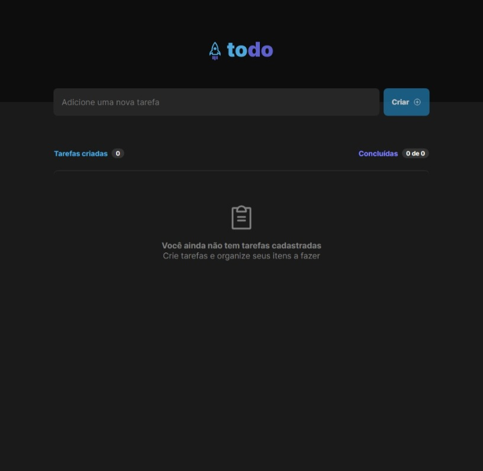
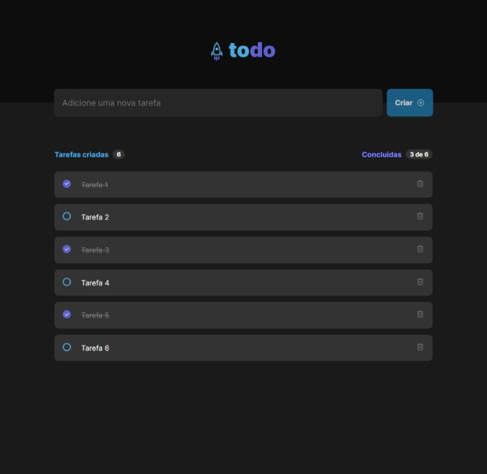

 
 

<h1>Todo List</h1>

> Simulação de página de uma lista de tarefas a serem executadas.

* Site front-end construído em React.JS com TypeScript;
* Enquanto não temos tarefas cadastradas, a tela contendo uma lista vazia é visualizada;
* Com as tarefas cadastradas, aparece a lista com os novos itens, com a contagem de tarefas e quantas delas foram concluídas;
* Qualquer uma delas pode ser deletada, concluída ou não.

 

